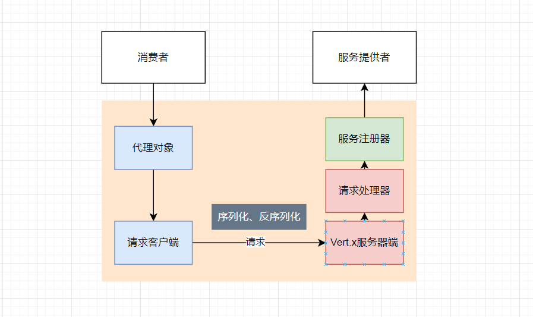

# EasyRPC

基于Java + Vert.x 自定义协议的RPC框架

**项目架构**

- [x] 硬编码服务注册器
- [x] Handler请求处理器
- [x] JdkSerializer序列化器
- [x] JDK动态代理，工厂模式
- [x] Vert.x服务器端
- [ ] Mock服务
- [ ] SPI动态加载
- [ ] 全局配置加载
- [ ] Etcd注册中心